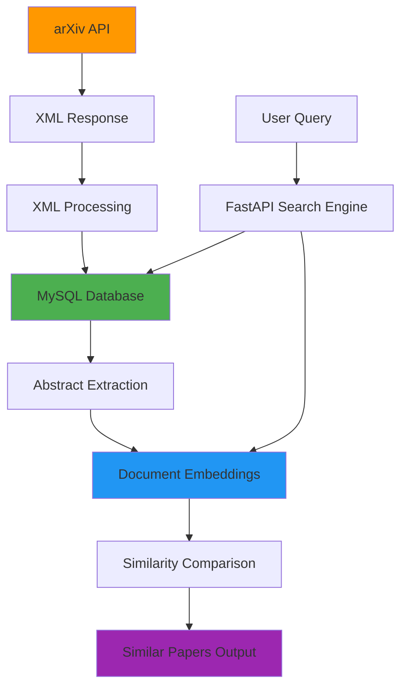

# 📚 arXiv Research Paper Search Engine

> Efficient Academic Paper Discovery with Advanced Document Embeddings and Semantic Search

[](https://www.python.org/)
[](https://fastapi.tiangolo.com/)
[](https://www.mysql.com/)
[](https://arxiv.org/help/api)

**By: Rustom Bhesania & Viresh Kashetti**  
*Text Technology Summer 25*

---

## 🎯 Problem Statement

Current academic research discovery faces several challenges:

- **Time-Intensive Literature Review**
- **Limited Search Capabilities**
- **Lack of Semantic Understanding**
- **No Similarity Analysis**

---

## 💡 Proposed Solution

A **local database of arXiv papers** with advanced similarity evaluation using:

- Document Embeddings (BERT-based)
- XML parsing of arXiv responses
- Multi-modal Search Capabilities
- FastAPI Interface for Real-Time Semantic Search

---

## 🏗️ System Architecture



---

## 🚀 Key Features

### 📌 Core Features

* **arXiv API Integration:** Query by category, keyword, or author
* **XML Parsing:** Efficient XML processing of arXiv responses
* **MySQL Storage:** Reliable local storage of metadata and embeddings
* **BERT-based Embeddings:** Using Sentence-BERT's lightweight all-MiniLM-L6-v2 model
* **REST API:** Easy integration with frontend apps or other services
* **CORS Enabled:** Ready for cross-origin HTTP requests
* **Rate Limit Respect:** Built-in delays for API usage guidelines
* **Semantic Search:** Find papers semantically similar to a query using document embeddings

### 🧠 Technical Features

* Semantic ranking and similarity search
* Batch embedding processing
* MySQL backend with BLOB storage
* Swagger UI for API testing
* Deduplication and error handling

---

## 🛠️ Tech Stack

| Component          | Technology                  |
| ------------------ | --------------------------- |
| **Backend**        | FastAPI, Python             |
| **Database**       | MySQL                       |
| **Embeddings**     | Sentence-BERT, Transformers |
| **XML Processing** | lxml, XPath                 |
| **Data Source**    | arXiv API                   |

---

## 📦 Installation & Setup

### Prerequisites

* Python 3.8+
* MySQL Server (native or via Docker)
* Git

### Step-by-Step Setup

```bash
# 1. Clone Repository
git clone https://github.com/Viresh26/Text_Technology.git
cd Text_Technology

# 2. Create Virtual Environment
python -m venv venv
source venv/bin/activate  # Windows: venv\Scripts\activate

# 3. Install Dependencies
pip install requests lxml mysql-connector-python sentence-transformers torch python-dotenv fastapi uvicorn

# 4. MySQL Setup
# Option 1: Docker
docker run --name arxiv-mysql -e MYSQL_ROOT_PASSWORD=my_strong_password -p 3306:3306 -d mysql/mysql-server:latest

# Option 2: Native MySQL
mysql -u root -p
```

### Database Configuration

```sql
CREATE DATABASE arxiv_papers;
CREATE USER 'arxiv_app_user'@'localhost' IDENTIFIED BY 'your_secure_password';
GRANT ALL PRIVILEGES ON arxiv_papers.* TO 'arxiv_app_user'@'localhost';
FLUSH PRIVILEGES;
EXIT;
```

### Environment Variables

Create `.env` file in project root:

```ini
MYSQL_HOST=localhost
MYSQL_USER=arxiv_app_user
MYSQL_PASSWORD=your_secure_password
MYSQL_DATABASE=arxiv_papers
```

---

## 📁 Project Structure

```
Text_Technology/
├── README.md             # This file
├── .env                  # Database credentials (create this)
├── requirements.txt      # Python dependencies (optional)
├── pyscraper.py         # Demonstration script for arXiv API
├── arxiv_pipeline.py    # Main data ingestion pipeline
└── fastapi_app.py       # Embedding API server
```

---

## 🔄 Usage Workflow

### Phase 1: Data Ingestion and Embedding Generation

Run the pipeline script to fetch and process papers:

```bash
python arxiv_pipeline.py
```

**What it does:**
* Connects to MySQL, creates table if missing
* Fetches papers (default 200 from `cs.AI`) from arXiv API
* Parses XML and inserts metadata
* Generates and stores embeddings for papers without embeddings

**Customize the fetch:**

```python
# In arxiv_pipeline.py, modify the main call:
if __name__ == "__main__":
    run_pipeline(search_category="cat:physics.comp-ph", max_papers_to_fetch=100)
    # or
    # run_pipeline(search_query="au:Y. Lecun", max_papers_to_fetch=50)
```

### Phase 2: Running the Embedding API

Start FastAPI server:

```bash
uvicorn fastapi_app:app --host 0.0.0.0 --port 8000 --reload
```

Access API documentation:
```
http://127.0.0.1:8000/docs
```

### Auxiliary: Paper Scraper Demo

The `pyscraper.py` demonstrates basic arXiv API usage:

```bash
python pyscraper.py
```

* Demonstrates keyword search for arXiv CS papers
* Fetches and logs raw XML responses
* For learning API calls, not full ingestion

---

## 📡 API Documentation

### 1. Health Check

**GET** `/health`

Response:
```json
{
  "status": "ok",
  "model_loaded": true
}
```

### 2. Single Text Embedding

**POST** `/embed`

Input:
```json
{
  "text": "Your abstract or text here."
}
```

Response:
```json
{
  "embedding": [0.1234, -0.5678, ...],
  "model_used": "all-MiniLM-L6-v2"
}
```

### 3. Batch Embedding

**POST** `/embed_batch`

Input:
```json
{
  "texts": [
    "First document text",
    "Second document text"
  ]
}
```

Response:
```json
{
  "embeddings": [
    [0.111, -0.222, ...],
    [0.333, -0.444, ...]
  ],
  "model_used": "all-MiniLM-L6-v2"
}
```

### 4. Search Similar Papers by Semantic Similarity

**POST** `/search_similar_papers`

Searches the locally stored arXiv papers for documents semantically similar to the query_text. Returns the top_k most similar papers along with their similarity scores.

Input:
```json
{
  "query_text": "Explain recent breakthroughs in artificial intelligence for medical diagnosis.",
  "top_k": 5
}
```

Response:
```json
{
  "query_embedding": [...],
  "results": [
    {
      "arxiv_id": "2301.01234",
      "title": "AI in Medical Imaging: A Review",
      "abstract": "This paper reviews...",
      "authors": "Jane Doe, John Smith",
      "primary_category": "cs.CV",
      "published_date": "2023-01-15",
      "similarity_score": 0.876
    }
    // ... more similar papers
  ],
  "model_used": "all-MiniLM-L6-v2"
}
```

---

## 🧪 Usage Examples

```python
import requests

# Health check
response = requests.get("http://localhost:8000/health")
print(response.json())

# Single embedding
response = requests.post("http://localhost:8000/embed", json={
    "text": "This paper proposes a novel neural network architecture for natural language processing."
})
embedding = response.json()["embedding"]

# Batch embeddings
response = requests.post("http://localhost:8000/embed_batch", json={
    "texts": [
        "First research paper abstract...",
        "Second research paper abstract..."
    ]
})
embeddings = response.json()["embeddings"]

# Semantic search for similar papers
response = requests.post("http://localhost:8000/search_similar_papers", json={
    "query_text": "new machine learning methods for healthcare",
    "top_k": 3
})
search_results = response.json()
print(search_results)
```

---

## 🚧 Common Challenges & Solutions

| Challenge         | Solution                         |
| ----------------- | -------------------------------- |
| arXiv Rate Limits | Smart batching and delays        |
| Large Embedding Storage | MySQL BLOB with compression |
| Memory Usage      | Batch processing + cleanup       |
| API Timeouts      | Retry logic and error handling   |

---

## 🔮 Future Roadmap

### Phase 1 – Enhanced Search

* Similarity search endpoint
* Advanced filtering by category/author
* Citation analysis integration

### Phase 2 – User Interface

* Web frontend (React/Streamlit)
* Personalized paper recommendations
* Paper collection management

### Phase 3 – Advanced Features

* Multi-modal search (text + metadata)
* Research collaboration tools
* Public API with authentication

---

## 🚀 Deployment Notes

* Use a `Dockerfile` to containerize for cloud deployment
* Manage environment variables securely on platform
* Adjust CORS `allow_origins` in `fastapi_app.py` for production
* Add `.env` to `.gitignore`
* Consider using FAISS for large-scale similarity search

---

## 🧪 Testing

```bash
# Test the pipeline
python arxiv_pipeline.py

# Test the API
uvicorn fastapi_app:app --reload
# Then visit http://localhost:8000/docs

# Test individual components
python pyscraper.py
```

---

## 🤝 Contributing

1. Fork the repository
2. Create a feature branch: `git checkout -b feature-name`
3. Add your feature and test it
4. Push and open a Pull Request

---

## 📚 References

* [arXiv API Documentation](https://info.arxiv.org/help/api/index.html)
* [Sentence-BERT Paper](https://www.sbert.net/)
* [FastAPI Documentation](https://fastapi.tiangolo.com/)
* Reimers & Gurevych, 2019 - Sentence-BERT
* Cer et al., 2018 - Universal Sentence Encoder

---

## 📄 License

Licensed under the **MIT License**. See the [LICENSE](LICENSE) file for details.

---

## 👥 Authors

* **Rustom Bhesania** - Co-developer
* **Viresh Kashetti** - Co-developer

*Text Technology Summer 25*

---

## 🆘 Support

* [GitHub Issues](https://github.com/Viresh26/Text_Technology/issues)
* [GitHub Repository](https://github.com/Viresh26/Text_Technology)

---

**⭐ Found it helpful? Star the repo to show your support!**
