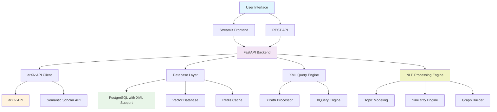
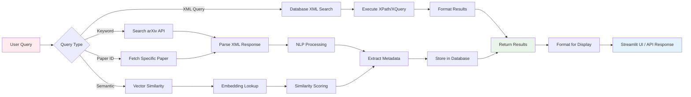
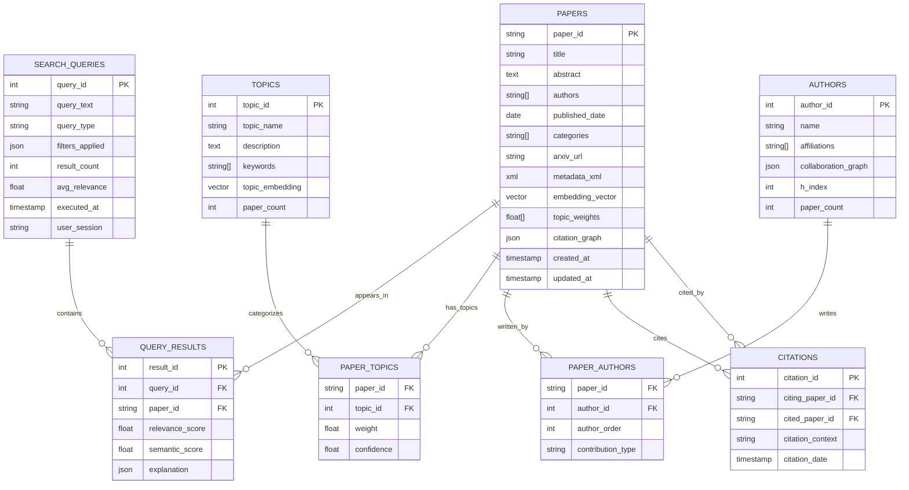

# 📚 arXiv Research Paper Search Engine

> An efficient, scalable search engine for academic research papers leveraging the arXiv API with advanced XML querying capabilities and an interactive web interface.

[](https://www.python.org/)
[](https://fastapi.tiangolo.com/)
[](https://streamlit.io/)
[](https://www.postgresql.org/)

---

## 🎯 Overview

This project creates a comprehensive search system for arXiv research papers, enabling researchers and students to efficiently discover, analyze, and access academic publications through multiple interfaces including keyword search, paper ID lookup, and advanced XML-based querying.

### Key Capabilities
- **Real-time Data Collection** from arXiv's open API
- **Advanced XML Querying** with XPath/XQuery support
- **Scalable Database Storage** with optimized indexing
- **Interactive Web Interface** built with Streamlit
- **REST API** for programmatic access
- **Flexible Search Options** supporting various query types

---

## 🏗️ System Architecture

### High-Level Architecture
```
┌─────────────────┐    ┌─────────────────┐    ┌─────────────────┐
│   Data Sources  │    │   Processing    │    │   Applications  │
│                 │    │     Pipeline    │    │                 │
│ • arXiv API     │────│ • NLP Engine    │────│ • Web Interface │
│ • Semantic      │    │ • ML Models     │    │ • REST API      │
│   Scholar       │    │ • Graph Builder │    │ • Visualizations│
│ • Manual Feeds  │    │ • Topic Models  │    │ • Export Tools  │
└─────────────────┘    └─────────────────┘    └─────────────────┘
         │                       │                       │
         │              ┌─────────────────┐              │
         └──────────────│   Data Storage  │──────────────┘
                        │                 │
                        │ • PostgreSQL    │
                        │ • Vector DB     │
                        │ • File Storage  │
                        │ • Cache Layer   │
                        └─────────────────┘
```

### Detailed Component Architecture


## 🔄 Data Processing Pipeline

### Processing Flow
```
Data Ingestion → NLP Processing → Storage & Indexing → Query & Retrieval
      │               │                   │                    │
  ┌───────────┐  ┌──────────────┐  ┌──────────────┐  ┌────────────────┐
  │ • API     │  │ • Text Clean │  │ • PostgreSQL │  │ • Keyword      │
  │   Calls   │  │ • Embedding  │  │ • Vector DB  │  │   Search       │
  │ • Rate    │  │ • Topic      │  │ • Indexing   │  │ • Semantic     │
  │   Limits  │  │   Modeling   │  │ • Caching    │  │   Similarity   │
  │ • Parsing │  │ • Graph      │  │ • Backup     │  │ • XML Queries  │
  └───────────┘  └──────────────┘  └──────────────┘  └────────────────┘
```

### Query Processing Flow


## 🗄️ Enhanced Database Architecture

### Database Schema with Advanced Features


### Storage Architecture
```
                    ┌─────────────────────────────────────┐
                    │          Data Storage Layer         │
                    └─────────────────────────────────────┘
                                      │
        ┌─────────────────┬───────────┼───────────┬─────────────────┐
        │                 │           │           │                 │
┌───────────────┐ ┌───────────────┐ ┌─────────┐ ┌───────────────┐ ┌──────────┐
│  PostgreSQL   │ │   Vector DB   │ │  Redis  │ │  File Storage │ │ Backup   │
│               │ │   (Pinecone/  │ │ Cache   │ │   (MinIO/S3)  │ │ System   │
│ • Metadata    │ │   Chroma)     │ │         │ │               │ │          │
│ • XML Data    │ │ • Embeddings  │ │ • Query │ │ • PDF Files   │ │ • Daily  │
│ • Relations   │ │ • Similarity  │ │   Cache │ │ • Images      │ │   Snapshots│
│ • Full-text   │ │   Search      │ │ • Session│ │ • Exports     │ │ • Archives │
│   Indexes     │ │ • Clustering  │ │   Data  │ │ • Temp Files  │ │          │
└───────────────┘ └───────────────┘ └─────────┘ └───────────────┘ └──────────┘
```

---

## 🚀 Features

### Core Functionality
- **Multi-Modal Search**: Keyword, paper ID, author name, and category-based searches
- **XML-Powered Queries**: Advanced filtering using XPath and XQuery expressions
- **Real-Time Data**: Live fetching from arXiv API with intelligent caching
- **Rich Metadata**: Comprehensive paper information including abstracts, authors, and categories

### Technical Features
- **Scalable Architecture**: Designed to handle large volumes of research papers
- **Database Flexibility**: Support for both PostgreSQL (XML-native) and MongoDB
- **API-First Design**: RESTful endpoints for integration with other tools
- **Responsive UI**: Clean, intuitive interface optimized for research workflows

---

## 📋 Requirements Coverage

| Course Requirement | Implementation |
|-------------------|----------------|
| **Data Collection** | arXiv API integration with rate limiting and error handling |
| **Data Preparation** | XML parsing, text normalization, and metadata extraction |
| **Data Access** | REST API endpoints and interactive Streamlit interface |
| **XML Technology** | Native XML storage, XPath/XQuery processing |
| **Database Usage** | PostgreSQL with XML extensions or MongoDB |
| **Text Processing** | Abstract analysis, keyword extraction, linguistic processing |
| **Technical Extension** | Advanced XML querying on real-world academic data |

---

### Backend Technology Stack
```
    API Layer           Business Logic         Data Processing
┌──────────────────┐  ┌──────────────────┐  ┌──────────────────┐
│                  │  │                  │  │                  │
│  ┌─────────────┐ │  │  ┌─────────────┐ │  │  ┌─────────────┐ │
│  │   FastAPI   │ │  │  │ Search      │ │  │  │ NLP Engine  │ │
│  │             │ │  │  │ Engine      │ │  │  │             │ │
│  │ • REST      │ │  │  │             │ │  │  │ • spaCy     │ │
│  │ • GraphQL   │ │  │  │ • Indexing  │ │  │  │ • NLTK      │ │
│  │ • WebSocket │ │  │  │ • Ranking   │ │  │  │ • Transformers│ │
│  └─────────────┘ │  │  │ • Filtering │ │  │  │ • Embeddings│ │
│                  │  │  └─────────────┘ │  │  └─────────────┘ │
│  ┌─────────────┐ │  │                  │  │                  │
│  │Authentication│ │  │  ┌─────────────┐ │  │  ┌─────────────┐ │
│  │             │ │  │  │ XML Query   │ │  │  │ ML Pipeline │ │
│  │ • JWT       │ │  │  │ Engine      │ │  │  │             │ │
│  │ • OAuth     │ │  │  │             │ │  │  │ • Topic     │ │
│  │ • Rate Limit│ │  │  │ • XPath     │ │  │  │   Modeling  │ │
│  └─────────────┘ │  │  │ • XQuery    │ │  │  │ • Clustering│ │
└──────────────────┘  │  │ • XSLT      │ │  │  │ • Similarity│ │
                      │  └─────────────┘ │  │  └─────────────┘ │
                      └──────────────────┘  └──────────────────┘
```

### Frontend Architecture
```
    User Interface          State Management        Data Visualization
┌──────────────────┐      ┌──────────────────┐    ┌──────────────────┐
│                  │      │                  │    │                  │
│  ┌─────────────┐ │      │  ┌─────────────┐ │    │  ┌─────────────┐ │
│  │ Streamlit   │ │      │  │ Session     │ │    │  │ Plotly      │ │
│  │ Components  │ │      │  │ State       │ │    │  │ Charts      │ │
│  │             │ │      │  │             │ │    │  │             │ │
│  │ • Search    │ │      │  │ • User      │ │    │  │ • Network   │ │
│  │   Interface │ │      │  │   Prefs     │ │    │  │   Graphs    │ │
│  │ • Results   │ │      │  │ • Query     │ │    │  │ • Topic     │ │
│  │   Display   │ │      │  │   History   │ │    │  │   Clusters  │ │
│  │ • Filters   │ │      │  │ • Cache     │ │    │  │ • Timeline  │ │
│  └─────────────┘ │      │  └─────────────┘ │    │  └─────────────┘ │
│                  │      │                  │    │                  │
│  ┌─────────────┐ │      │  ┌─────────────┐ │    │  ┌─────────────┐ │
│  │ Navigation  │ │      │  │ Real-time   │ │    │  │ Export      │ │
│  │             │ │      │  │ Updates     │ │    │  │ Tools       │ │
│  │ • Multi-page│ │      │  │             │ │    │  │             │ │
│  │ • Sidebar   │ │      │  │ • WebSocket │ │    │  │ • PDF       │ │
│  │ • Breadcrumb│ │      │  │ • Progress  │ │    │  │ • CSV       │ │
│  └─────────────┘ │      │  │   Bars      │ │    │  │ • BibTeX    │ │
└──────────────────┘      │  └─────────────┘ │    │  └─────────────┘ │
                          └──────────────────┘    └──────────────────┘
```

---

## 📦 Installation & Setup

### Prerequisites
- Python 3.8 or higher
- PostgreSQL 13+ (or MongoDB 4.4+)
- Git

### Quick Start

1. **Clone the repository**
   ```bash
   git clone https://github.com/yourusername/arxiv-search-engine.git
   cd arxiv-search-engine
   ```

2. **Set up virtual environment**
   ```bash
   python -m venv venv
   source venv/bin/activate  # On Windows: venv\Scripts\activate
   ```

3. **Install dependencies**
   ```bash
   pip install -r requirements.txt
   ```

4. **Configure database**
   ```bash
   cp config.example.py config.py
   # Edit config.py with your database credentials
   ```

5. **Initialize database**
   ```bash
   python scripts/init_db.py
   ```

6. **Start the backend API**
   ```bash
   uvicorn app.main:app --reload --port 8000
   ```

7. **Launch the frontend** (in a new terminal)
   ```bash
   streamlit run frontend/app.py
   ```

8. **Access the application**
   - Frontend: http://localhost:8501
   - API Documentation: http://localhost:8000/docs

---

## 📁 Project Structure

```
arxiv-search-engine/
├── 📁 app/                     # Backend application
│   ├── 📄 main.py             # FastAPI application entry point
│   ├── 📁 api/                # API route handlers
│   │   ├── 📄 search.py       # Search endpoints
│   │   ├── 📄 papers.py       # Paper management endpoints
│   │   └── 📄 xml_query.py    # XML querying endpoints
│   ├── 📁 core/               # Core business logic
│   │   ├── 📄 arxiv_client.py # arXiv API client
│   │   ├── 📄 xml_processor.py# XML processing utilities
│   │   └── 📄 search_engine.py# Search logic
│   ├── 📁 db/                 # Database layer
│   │   ├── 📄 models.py       # Database models
│   │   ├── 📄 connection.py   # Database connection
│   │   └── 📄 repositories.py # Data access layer
│   └── 📁 utils/              # Utility functions
├── 📁 frontend/               # Streamlit frontend
│   ├── 📄 app.py             # Main Streamlit application
│   ├── 📁 components/        # Reusable UI components
│   └── 📁 pages/             # Multi-page application
├── 📁 scripts/               # Utility scripts
│   ├── 📄 init_db.py         # Database initialization
│   └── 📄 data_migration.py  # Data migration utilities
├── 📁 tests/                 # Test suite
├── 📄 config.py              # Configuration settings
├── 📄 requirements.txt       # Python dependencies
├── 📄 docker-compose.yml     # Docker deployment
└── 📄 README.md              # This file
```

---

## 🔍 Usage Examples

### Basic Keyword Search
```python
# Using the API directly
import requests

response = requests.get(
    "http://localhost:8000/api/search",
    params={"query": "machine learning", "max_results": 10}
)
papers = response.json()
```

### Advanced XML Query
```python
# XPath query for papers in specific categories
xpath_query = "//paper[category='cs.AI' or category='cs.LG']"
response = requests.post(
    "http://localhost:8000/api/xml-query",
    json={"xpath": xpath_query}
)
```

### Frontend Interface
1. Open http://localhost:8501 in your browser
2. Enter search terms in the sidebar
3. Apply filters for date range, categories, or authors
4. View results with abstracts and direct arXiv links
5. Export results to CSV or JSON

---

## 🧪 Testing

Run the test suite:
```bash
pytest tests/ -v
```

Run with coverage:
```bash
pytest tests/ --cov=app --cov-report=html
```

---

## 🚢 Deployment

### Using Docker
```bash
docker-compose up -d
```

### Manual Deployment
1. Set up production database
2. Configure environment variables
3. Install dependencies: `pip install -r requirements.txt`
4. Run migrations: `python scripts/init_db.py`
5. Start services with a process manager like systemd or supervisor

---

## 🤝 Contributing

We welcome contributions! Please see our [Contributing Guidelines](CONTRIBUTING.md) for details.

1. Fork the repository
2. Create a feature branch: `git checkout -b feature-name`
3. Make your changes and add tests
4. Commit your changes: `git commit -am 'Add feature'`
5. Push to the branch: `git push origin feature-name`
6. Submit a pull request

---

## 📄 License

This project is licensed under the MIT License - see the [LICENSE](LICENSE) file for details.

---

## 🆘 Support

- **Issues**: [GitHub Issues](https://github.com/yourusername/arxiv-search-engine/issues)
- **Discussions**: [GitHub Discussions](https://github.com/yourusername/arxiv-search-engine/discussions)
- **Email**: your.email@example.com

---

## 🙏 Acknowledgments

- [arXiv](https://arxiv.org/) for providing open access to research papers
- [FastAPI](https://fastapi.tiangolo.com/) for the excellent web framework
- [Streamlit](https://streamlit.io/) for the intuitive frontend framework
- The open-source community for the amazing tools and libraries

---

**⭐ If you find this project useful, please consider giving it a star!**
