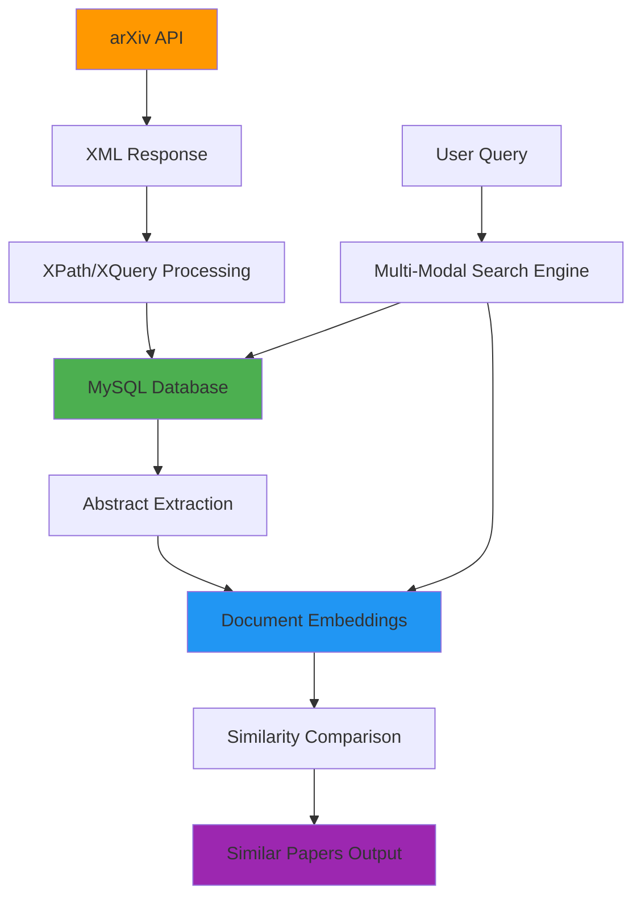

# 📚 arXiv Research Paper Search Engine

> Efficient Academic Paper Discovery with Advanced XML Querying and Document Embeddings

[](https://www.python.org/)
[](https://fastapi.tiangolo.com/)
[](https://www.mysql.com/)
[](https://arxiv.org/help/api)

**By: Rustom Bhesania & Viresh Kashetti**  
*Text Technology Summer 25*

---

## 🎯 Problem Statement

Current academic research discovery faces several challenges:

- **Time-Intensive Literature Review**: Finding similar papers requires significant manual effort
- **Limited Search Capabilities**: arXiv searches are primarily based on titles and authors, not paper content
- **Lack of Semantic Understanding**: Traditional keyword matching misses conceptually similar papers
- **No Similarity Analysis**: Researchers need advanced techniques like document embeddings to find related work

## 💡 Proposed Solution

We aim to create a **local database of arXiv papers** with advanced similarity evaluation capabilities to streamline literature review processes. Our solution leverages:

- **Document Embeddings** for semantic similarity
- **XML-based Data Processing** for efficient parsing
- **Multi-Modal Search** capabilities
- **Real-Time API Integration** with intelligent caching

---

## 🏗️ System Architecture



### Data Flow Architecture

```
┌─────────────┐    ┌──────────────┐    ┌─────────────┐    ┌──────────────┐
│ arXiv API   │────│ XML Parser   │────│ MySQL DB    │────│ Embedding    │
│ • Category  │    │ • XPath      │    │ • Abstracts │    │ Generator    │
│ • Keyword   │    │ • XQuery     │    │ • Metadata  │    │ • Transformers│
│ • Author    │    │ • XML Schema │    │ • Relations │    │ • Similarity │
└─────────────┘    └──────────────┘    └─────────────┘    └──────────────┘
```

---

## 🔄 Workflow Process

### 1. Data Collection
- **arXiv API Integration**: Fetch papers by Category, Keyword, or Author
- **XML Response Processing**: Direct API requests provide structured XML data
- **Batch Processing**: Multiple papers retrieved in single API calls
- **Metadata Focus**: Abstracts and essential paper information
- **Semantic Scholar Backup**: Additional data source when needed

### 2. Data Processing Pipeline
```
XML Response → XPath/XQuery Parsing → MySQL Storage → Embedding Generation → Similarity Analysis
```

### 3. Search & Discovery
- **Reference Paper Input**: User provides a paper of interest
- **Embedding Comparison**: Generate and compare document embeddings
- **Similarity Ranking**: Return papers with closest semantic similarity
- **Literature Recommendations**: Suggest papers for further reading

---

## 🚀 Key Features

### Core Functionality
- **Multi-Modal Search**: Support for keyword, semantic, author, and category-based searches
- **Advanced XML Querying**: XPath and XQuery capabilities for precise data extraction
- **Smart Analytics**: Topic similarity using state-of-the-art document embeddings
- **Real-Time Integration**: Live arXiv API with intelligent caching strategies

### Technical Features
- **Document Embeddings**: Multiple embedding models for semantic analysis
- **Export Options**: PDF and HTML output formats
- **Rate Limit Management**: Smart scheduling to respect arXiv API constraints
- **Local Database**: MySQL storage for fast retrieval and analysis

---

## 🛠️ Technology Stack

| Component | Technology | Purpose |
|-----------|------------|---------|
| **Backend API** | FastAPI | High-performance REST API |
| **Database** | MySQL | Structured data storage |
| **XML Processing** | XPath/XQuery | Data parsing and extraction |
| **Embeddings** | Transformers | Document similarity analysis |
| **Data Source** | arXiv API | Primary research paper source |
| **Additional Data** | Semantic Scholar | Supplementary paper information |

### Embedding Models Considered
- **Sentence-BERT** (all-MiniLM-L6-v2)
- **Universal Sentence Encoder**
- **Doc2Vec** (Gensim)
- **E5 Models** (intfloat/e5-small)

---

## 📋 Installation & Setup

### Prerequisites
- Python 3.8+
- MySQL 8.0+
- Git

### Quick Start

1. **Clone the repository**
   ```bash
   git clone https://github.com/Viresh26/Text_Technology.git
   cd Text_Technology
   ```

2. **Set up virtual environment**
   ```bash
   python -m venv venv
   source venv/bin/activate  # On Windows: venv\Scripts\activate
   ```

3. **Install dependencies**
   ```bash
   pip install -r requirements.txt
   ```

4. **Configure MySQL database**
   ```bash
   # Create database and update connection settings
   mysql -u root -p
   CREATE DATABASE arxiv_papers;
   ```

5. **Initialize database schema**
   ```bash
   python scripts/init_database.py
   ```

6. **Start the FastAPI server**
   ```bash
   uvicorn main:app --reload --port 8000
   ```

7. **Access the API documentation**
   - API Docs: http://localhost:8000/docs

---

## 🔍 Usage Examples

### Basic Paper Search
```python
import requests

# Search by keyword
response = requests.get(
    "http://localhost:8000/search",
    params={
        "query": "machine learning",
        "category": "cs.AI",
        "max_results": 20
    }
)
papers = response.json()
```

### Similarity Analysis
```python
# Find similar papers
response = requests.post(
    "http://localhost:8000/similarity",
    json={
        "reference_paper_id": "2103.00020",
        "similarity_threshold": 0.7
    }
)
similar_papers = response.json()
```

### XML Query Processing
```python
# Advanced XML querying
response = requests.post(
    "http://localhost:8000/xml-query",
    json={
        "xpath": "//entry[contains(summary, 'neural network')]",
        "limit": 50
    }
)
results = response.json()
```

---

## 🚧 Challenges & Solutions

### Data Availability & Access
- **Challenge**: arXiv API rate limits require careful request management
- **Solution**: Implement smart scheduling and local caching strategies
- **Challenge**: Not all research papers are available on arXiv
- **Solution**: Integration with Semantic Scholar for broader coverage

### Performance Constraints
- **Challenge**: Document embedding generation requires significant compute resources
- **Solution**: Efficient batching and model optimization techniques
- **Challenge**: Real-time similarity comparison at scale
- **Solution**: Pre-computed embeddings with indexed similarity search

---

## 🔮 Future Roadmap

### Phase 1: Core Enhancements
- **Personalized Recommendations**: User-specific paper suggestions based on reading history
- **Citation Analysis**: Advanced bibliometric insights and paper impact analysis

### Phase 2: Platform Expansion
- **Open Access API**: Public API with comprehensive documentation
- **Micro-SaaS Plugin**: Browser extension for seamless research workflow integration
- **Frontend Interface**: Web-based user interface for non-technical users

### Phase 3: Collaboration Features
- **Shared Collections**: Collaborative paper libraries and research groups
- **Annotation Tools**: Collaborative paper annotation and discussion features
- **Research Networks**: Connect researchers with similar interests

---

## 📊 Project Structure

```
Text_Technology/
├── 📄 main.py                 # FastAPI application entry
├── 📁 api/                    # API route handlers
│   ├── 📄 search.py          # Search endpoints
│   ├── 📄 similarity.py      # Similarity analysis
│   └── 📄 xml_query.py       # XML processing endpoints
├── 📁 core/                   # Core business logic
│   ├── 📄 arxiv_client.py    # arXiv API client
│   ├── 📄 xml_processor.py   # XML parsing utilities
│   ├── 📄 embeddings.py      # Document embedding generation
│   └── 📄 similarity.py      # Similarity computation
├── 📁 database/              # Database layer
│   ├── 📄 models.py          # Database models
│   ├── 📄 connection.py      # MySQL connection
│   └── 📄 repositories.py    # Data access layer
├── 📁 scripts/               # Utility scripts
│   └── 📄 init_database.py   # Database initialization
├── 📁 tests/                 # Test suite
├── 📄 requirements.txt       # Dependencies
└── 📄 README.md             # This file
```

---

## 🧪 Testing

Run the test suite:
```bash
pytest tests/ -v
```

Test with coverage:
```bash
pytest tests/ --cov=core --cov-report=html
```

---

## 🤝 Contributing

We welcome contributions to improve the arXiv Research Paper Search Engine!

1. Fork the repository
2. Create a feature branch: `git checkout -b feature-name`
3. Make your changes and add tests
4. Commit: `git commit -am 'Add new feature'`
5. Push: `git push origin feature-name`
6. Submit a pull request

---

## 📚 References

- **arXiv API Documentation**: https://info.arxiv.org/help/api/index.html
- **GitHub Repository**: https://github.com/Viresh26/Text_Technology
- **Sentence-BERT**: Reimers & Gurevych (2019)
- **Universal Sentence Encoder**: Cer et al. (2018)

---

## 📄 License

This project is licensed under the MIT License - see the [LICENSE](LICENSE) file for details.

---

## 👥 Authors

- **Rustom Bhesania** - Co-developer
- **Viresh Kashetti** - Co-developer

*Text Technology Summer 25*

---

## 🆘 Support

- **GitHub Issues**: [Report bugs and feature requests](https://github.com/Viresh26/Text_Technology/issues)
- **GitHub Repository**: [Source code and documentation](https://github.com/Viresh26/Text_Technology)

---

**⭐ If you find this project useful for your research, please consider giving it a star!**
